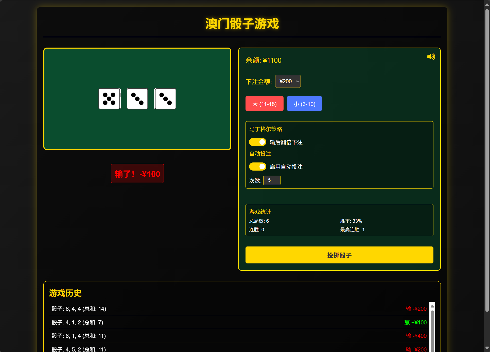
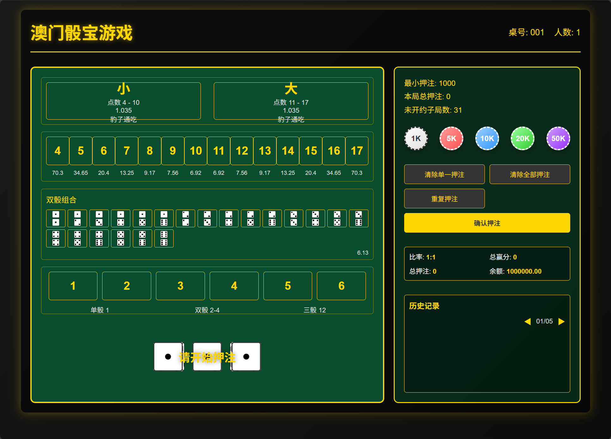

# 澳门骰子游戏项目说明

## 项目概述
这是一个使用HTML、CSS和JavaScript实现的3D骰子游戏，具有真实的骰子投掷动画效果和完整的投注系统。游戏采用现代化的UI设计，支持响应式布局，并包含多种游戏策略选项。

## 技术栈
- HTML5
- CSS3 (3D Transform)
- JavaScript (原生)
- Font Awesome 图标库

## 页面布局设计

### 1. 整体布局
- 采用渐变深色背景，营造赌场氛围
- 使用弹性布局（Flexbox）实现响应式设计
- 主要分为三个区域：
  - 骰子展示区
  - 控制面板
  - 历史记录区

### 2. 视觉设计
- 使用金色（#ffd700）作为主题色
- 半透明黑色背景增加层次感
- 阴影效果提升立体感
- 动画过渡效果增强交互体验

## 3D骰子实现

### 1. 3D骰子结构
```css
.dice {
    width: 60px;
    height: 60px;
    position: relative;
    transform-style: preserve-3d;
    transition: transform 1s;
}
```
- 使用CSS 3D变换创建骰子的六个面
- 通过`transform-style: preserve-3d`保持3D效果
- 使用`transition`实现平滑的动画效果

### 2. 骰子面的布局
```css
.dice-face {
    position: absolute;
    width: 60px;
    height: 60px;
    background-color: white;
    border: 2px solid #333;
    border-radius: 5px;
    display: flex;
    justify-content: center;
    align-items: center;
}
```
- 每个面都是绝对定位
- 使用Flexbox居中排列点数
- 添加边框和圆角增加真实感

### 3. 3D转换实现
```css
.dice-face:nth-child(1) { transform: translateZ(30px); }
.dice-face:nth-child(2) { transform: rotateX(180deg) translateZ(30px); }
.dice-face:nth-child(3) { transform: rotateY(90deg) translateZ(30px); }
.dice-face:nth-child(4) { transform: rotateY(-90deg) translateZ(30px); }
.dice-face:nth-child(5) { transform: rotateX(90deg) translateZ(30px); }
.dice-face:nth-child(6) { transform: rotateX(-90deg) translateZ(30px); }
```
- 使用`translateZ`创建立方体结构
- 通过`rotateX`和`rotateY`定位每个面
- 动态旋转实现投掷效果

### 4. 动画效果
- 投掷动画：使用CSS关键帧动画
- 晃动效果：模拟真实骰子投掷
- 胜负动画：添加脉冲效果增强反馈

## 游戏功能特点

### 1. 投注系统
- 支持多种投注金额选择
- 大小投注选项
- 实时余额更新

### 2. 策略系统
- 马丁格尔策略支持
- 自动投注功能
- 自定义投注次数

### 3. 统计功能
- 游戏总局数统计
- 胜率计算
- 连胜记录
- 最高连胜追踪

### 4. 其他功能
- 音效系统
- 历史记录
- 响应式设计适配移动端

## 项目特色
1. 真实的3D骰子效果
2. 流畅的动画过渡
3. 完整的游戏策略系统
4. 详细的统计和历史记录
5. 优雅的UI设计
6. 响应式布局支持各种设备




